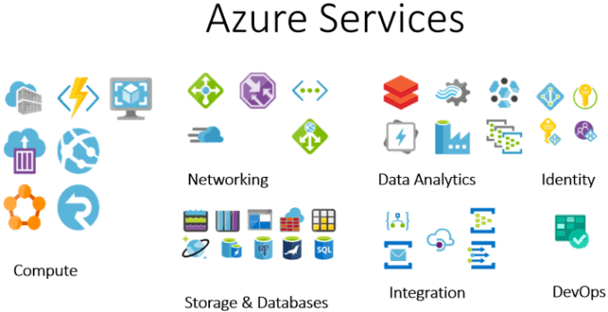
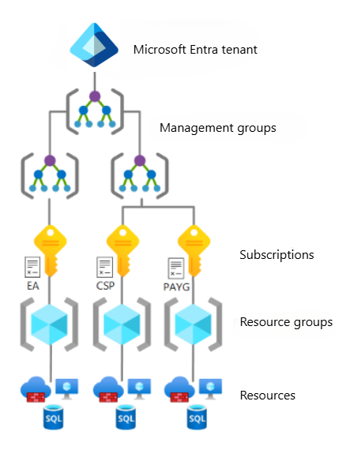

# Introdução à Computação em Nuvem e ao Portal Microsoft Azure

## Objetivos da aula

Ao final da aula, o aluno deverá ser capaz de compreender o conceito de computação em nuvem, diferenciar modelos de serviço, reconhecer a estrutura básica da Azure e navegar pelo Portal do Azure para localizar e administrar recursos.

## O que é Computação em Nuvem?

### Modelo Tradicional

```text
EMPRESA
   │
   ├── Compra servidor
   ├── Instala sistema operacional
   ├── Configura rede
   ├── Instala aplicações
   ├── Mantém equipamentos
   ├── Faz backup
   └── Substitui hardware
```
> A organização precisa adquirir e manter grande parte da infraestrutura.

### Computação em Nuvem

```text
USUÁRIO / EMPRESA
        │
        │ Internet
        ▼
┌──────────────────────────┐
│     PROVEDOR DE NUVEM    │
│                          │
│  Computação              │
│  Armazenamento           │
│  Banco de Dados          │
│  Redes                   │
│  Segurança               │
│  Aplicações              │
│  Inteligência Artificial │
│  Monitoramento           │
└──────────────────────────┘
```
Na nuvem, recursos computacionais podem ser provisionados e administrados como serviços, sem que o cliente precise possuir fisicamente toda a infraestrutura.

Uma boa analogia é a energia elétrica: normalmente não construímos uma usina para utilizar eletricidade em uma casa; consumimos um serviço e pagamos pelo uso.

## Benefícios de utilizar Computação em Nuvem

- provisionamento rápido;
- possibilidade de aumentar ou reduzir recursos;
- acesso por diferentes localidades;
- redução da necessidade de aquisição antecipada de infraestrutura;
- utilização de serviços gerenciados;
- disponibilidade de recursos globais;
- automação;
- monitoramento;
- pagamento associado ao modelo de contratação e consumo.

> Uma loja virtual recebe 500 acessos normalmente, mas durante uma promoção passa a receber 50 mil. O que aconteceria se o servidor não tivesse capacidade suficiente?

# Modelos de Serviço

## IaaS - Infrastructure as a Service

O provedor oferece infraestrutura.

Exemplo conceitual:
```text
Azure Virtual Machine
```

O cliente ainda administra boa parte do ambiente:

```text
Aplicação           ← Cliente
Dados               ← Cliente
Sistema operacional ← Cliente
-----------------------------
Virtualização       ← Provedor
Servidor            ← Provedor
Storage             ← Provedor
Rede física         ← Provedor
```

## PaaS — Platform as a Service

Aqui o desenvolvedor concentra-se mais na aplicação.

Exemplo:

```text
Código Web
   ↓
Azure App Service
   ↓
Azure administra boa parte
da infraestrutura
```

## SaaS — Software as a Service

O usuário utiliza uma aplicação pronta.

Exemplos conceituais:
```text
Microsoft 365
Outlook
Teams
```
Aqui o usuário não administra servidor ou runtime da aplicação.

#### Comparação

| Modelo | Exemplo de necessidade              |
| ------ | ----------------------------------- |
| IaaS   | "Preciso de um servidor."           |
| PaaS   | "Preciso publicar minha aplicação." |
| SaaS   | "Preciso utilizar um software."     |

### Tipos de Nuvem

#### Nuvem pública

Infraestrutura operada por um provedor de nuvem e disponibilizada aos clientes.

```text
Microsoft Azure
AWS
Google Cloud

```

#### Nuvem privada

Infraestrutura dedicada a uma determinada organização.

#### Nuvem híbrida

Combinação de ambientes locais/privados com serviços de nuvem pública.

```text
DATACENTER DA EMPRESA
         ↕
      INTERNET
         ↕
       AZURE
```

# O que é Microsoft Azure?

A Azure é a plataforma de computação em nuvem da Microsoft.

Ela disponibiliza diferentes categorias de serviços, como computação, armazenamento, bancos de dados, redes, segurança, monitoramento, integração e aplicações. O gerenciamento desses recursos é realizado por uma camada de gerenciamento baseada no Azure Resource Manager.




## Como os recursos são organizados na Azure?



## Management Groups


Management Groups podem organizar subscriptions para aplicação centralizada de governança; Resource Groups são agrupamentos lógicos de recursos relacionados e ficam dentro de uma subscription.


## Subscription

Uma Subscription é um escopo importante de organização, cobrança, controle de acesso e gerenciamento dos recursos Azure.

```text
Conta / Organização
        │
        ▼
   Subscription
        │
   ┌────┼────────┐
   ▼    ▼        ▼
Projeto A   Projeto B   Projeto C
```

## Resource Group

Esse é um dos conceitos que eu mais reforçaria.

Um Resource Group é um agrupamento lógico de recursos relacionados. A Microsoft recomenda pensar nele como um agrupamento de recursos que compartilham um ciclo de vida relacionado

```text
rg-portal-servicos
│
├── App Service
├── Banco de Dados
├── Storage Account
└── Application Insights
```
## Resource

Um Resource é uma instância de um serviço criada dentro da Azure.

```text
Virtual Machine
Storage Account
App Service
Azure SQL Database
Virtual Network
Function App
```

# O que é o Portal do Azure?

O Azure Portal é a interface gráfica Web para gerenciamento de recursos Azure; por meio dele é possível navegar pelos recursos, filtrá-los, criá-los e administrá-los.

1. Acesse o [Portal do Azure](https://portal.azure.com/)
2. Usuário email `Etec`
3. Clique para criar uma conta de Estudante.

