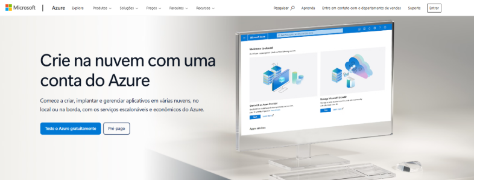
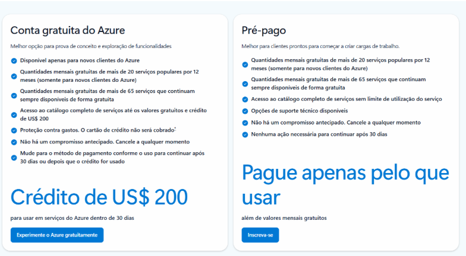

# Microsoft Azure Portal
O Microsoft Azure Portal é a plataforma web da Microsoft usada para criar, configurar e gerenciar serviços em nuvem de forma centralizada. Por meio dele, é possível acessar recursos como máquinas virtuais, bancos de dados, armazenamento, redes, inteligência artificial e segurança.

No portal, o usuário consegue:

- Criar novos serviços e recursos em poucos cliques
- Monitorar desempenho e uso dos recursos
- Configurar permissões e controle de acesso
- Acompanhar custos e consumo da nuvem
- Visualizar dashboards e relatórios
- Automatizar tarefas e implantações

Ele possui uma interface intuitiva que facilita tanto o uso por iniciantes quanto por profissionais de TI. Assim, o Azure Portal se torna uma ferramenta essencial para administrar soluções em nuvem com praticidade, segurança e escalabilidade.

Para quem está começando a estudar Inteligência Artificial, ele é a porta de entrada para acessar ferramentas de IA, armazenamento de dados, APIs, bancos de dados e recursos de segurança.

Você pode:

- Criar serviços de IA, como visão computacional, análise de texto e reconhecimento de fala
- Armazenar arquivos e dados na nuvem
- Criar bancos de dados e aplicativos
- Monitorar consumo de recursos
- Configurar segurança e permissões

Para começar, a Microsoft oferece a assinatura Azure for Students, voltada para estudantes. Com ela, é possível:

- Criar uma conta gratuita
- Receber créditos para testar serviços
- Acessar laboratórios e recursos educacionais
- Aprender na prática sem precisar de cartão de crédito (em muitos casos)

## Tipos de Contas

### Conta Gratuita (Free)
- Valido por 30 dias
- Disponibiliza $200
- É necessário adicionar um cartão de crédito

### Conta Estudante
- Válisdo por 365 dias
- Disponibiliza $100
- Não é necessário adicionar cartão de crédito

## Criando uma conta de estudante - Portal Azure

- Acesse o Portal Azure
- Criar ou entrar com uma conta Microsoft
- Validar vínculo estudantil com e-mail institucional
- Ativar a assinatura de estudante
- Entrar no portal e começar a criar recursos